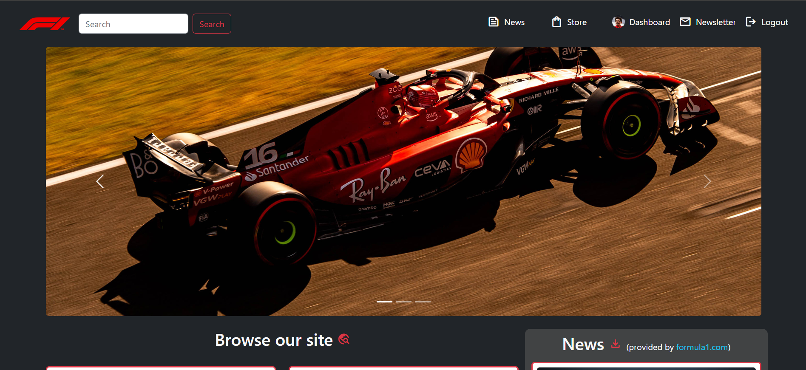
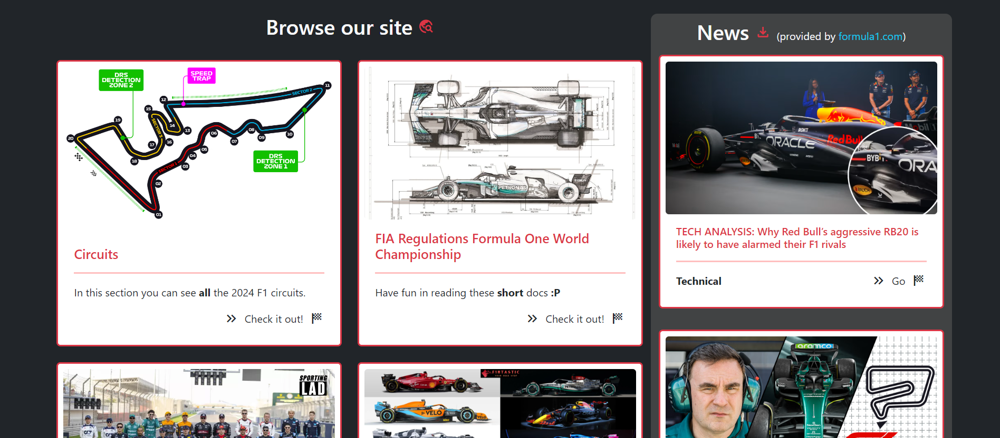
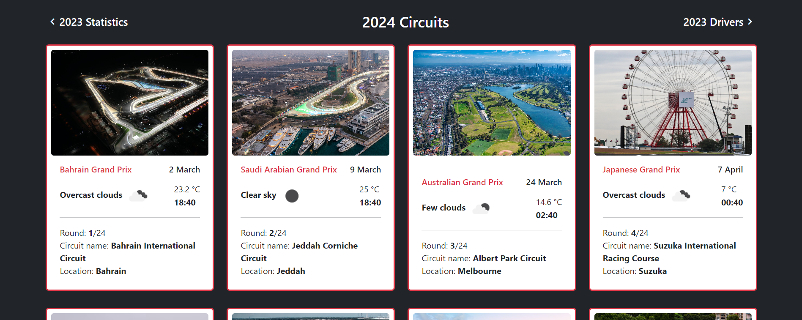
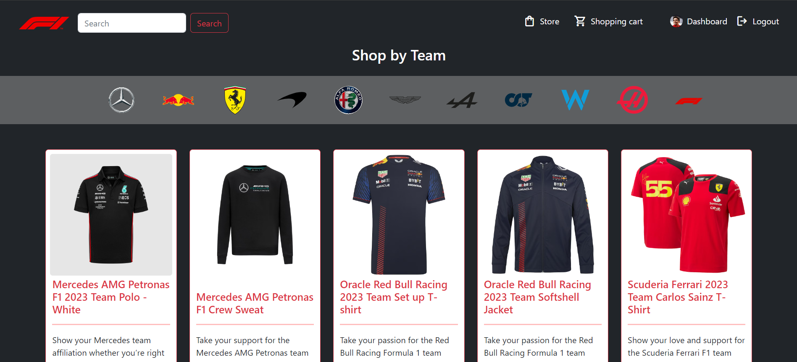
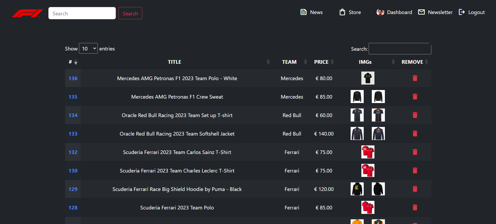

# F1 SAW
Web App with the aim of grouping everything useful about Formula 1

*keys.ini* file with setup keys inside is required 
to work properly with the DB (MySQL) and the [AWS-S3](https://aws.amazon.com/it/s3/) storage

For a proper presentation we suggest to view [F1 SAW](./F1_SAW.pdf)

**NB**: **ACADEMIC** purposes only
<hr>

### What you can do
- virtually buy products in the **STORE**
- keep yourself updated with the most recent **NEWS** 
- navigate in different **STATISTICS**, such as Drivers, Teams, Calendar 2024 and GP results (from 1950 to 2023).
- if you are an **ADMIN**, you can manage the store and users data, and email the users who subscribed to the newsletter

The news, teams and drivers lists are fetched through **web-scraping**
<hr>

### How
Back-end: PHP (and PHPMailer) / AWS-S3 / MySQL
<br>
Front-end: JS / CSS / Bootstrap / HTML
<hr>

### USAGE
- ```git clone --recursive-submodule {.git}```
- ```git submodule update --init --recursive```
- ```git submodule update --remote```


### SOURCES:
- [Formula 1](https://www.formula1.com/)
- [Open Weather Map](https://openweathermap.org/api)
- [AWS-S3](https://aws.amazon.com/it/s3/)

<hr>

#### Home



<hr>

#### Circuits

<hr>

#### Store

<hr>

#### Admin dashboard
